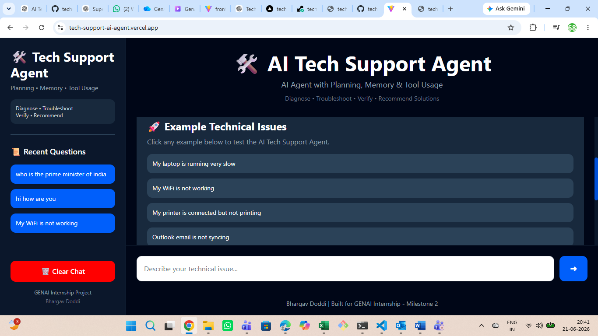

# 🛠 AI Tech Support Agent

> Intelligent Technical Troubleshooting Assistant using Planning, Memory, Tool Usage, and Google Gemini AI

---

# 📌 Project Overview

AI Tech Support Agent is an intelligent troubleshooting assistant developed as part of the **GENAI Internship Milestone 2 Project**.

The system helps users diagnose and resolve common technical support issues using:

* 🧠 Planning
* 💾 Memory
* 🛠 Tool Usage
* 🤖 Google Gemini AI

The agent provides structured troubleshooting solutions for:

* WiFi & Network Issues
* Printer Problems
* Login & Password Issues
* Bluetooth Connectivity Problems
* Outlook Email Synchronization
* Software Installation Failures
* Slow System Performance

---

# 🎯 Project Objectives

The objective of this project is to build an AI Agent capable of:

* Understanding technical support requests
* Classifying user queries
* Creating troubleshooting plans
* Using tools to gather information
* Maintaining conversation memory
* Generating structured solutions
* Rejecting unsupported non-technical questions

---

# ✅ Milestone Requirements Coverage

| Requirement        | Status      |
| ------------------ | ----------- |
| Planning           | ✅ Completed |
| Memory             | ✅ Completed |
| Tool Usage         | ✅ Completed |
| Gemini Integration | ✅ Completed |
| FastAPI Backend    | ✅ Completed |
| React Frontend     | ✅ Completed |
| SQLite Database    | ✅ Completed |
| Deployment         | ✅ Completed |
| GitHub Repository  | ✅ Completed |

---

# 🏗 System Architecture

```text
                        USER
                          │
                          ▼

            ┌───────────────────────────┐
            │   React + Vite Frontend   │
            └───────────────────────────┘
                          │
                          ▼

            ┌───────────────────────────┐
            │      FastAPI Backend      │
            └───────────────────────────┘
                          │
        ┌─────────────────┼─────────────────┐
        ▼                 ▼                 ▼

 ┌─────────────┐   ┌─────────────┐   ┌─────────────┐
 │  Planning   │   │   Memory    │   │    Tools    │
 │   Engine    │   │   Layer     │   │    Layer    │
 └─────────────┘   └─────────────┘   └─────────────┘
                                           │
                           ┌───────────────┴───────────────┐
                           ▼                               ▼

                 Device Information Tool      Troubleshooting Tool

                                           │
                                           ▼

                               Google Gemini AI

                                           │
                                           ▼

                              Structured Solution
```

---

# 🧠 Agent Workflow

```text
1. User submits technical issue
                    │
                    ▼

2. Query Classification
                    │
                    ▼

3. Generate Troubleshooting Plan
                    │
                    ▼

4. Retrieve Previous Memory
                    │
                    ▼

5. Execute Tools
                    │
                    ▼

6. Gemini AI Reasoning
                    │
                    ▼

7. Generate Structured Solution
                    │
                    ▼

8. Display Results to User
```

---

# 🚀 Key Features

## ✅ Intelligent Query Classification

The system automatically classifies user input into:

### Technical Support Queries

Examples:

* My WiFi is not working
* Printer is connected but not printing
* Bluetooth mouse is not connecting
* Outlook email is not syncing

### Unsupported Queries

Examples:

* What is the capital of India?
* Tell me a joke
* What is your favorite movie?

The agent politely rejects unsupported questions.

---

## ✅ Planning Engine

For every technical issue, the system generates a troubleshooting workflow.

### Example

**Printer Issue**

1. Check Printer Connection
2. Verify Printer Status
3. Inspect Printer Drivers
4. Recommend Fix

---

## ✅ Memory System

The Memory Layer stores previous user issues using SQLite.

### Capabilities

* Save issue history
* Retrieve previous issues
* Display memory in UI
* Maintain troubleshooting context

---

## ✅ Device Information Tool

Provides device-specific information.

### Supported Devices

* Laptop
* Desktop
* Mobile
* Printer

### Example Output

```json
{
  "device": "Laptop",
  "os": "Windows 11",
  "ram": "8GB",
  "storage": "256GB SSD"
}
```

---

## ✅ Troubleshooting Tool

Provides predefined troubleshooting workflows.

### Supported Categories

* WiFi Issues
* Printer Issues
* Login Problems
* Password Reset
* Bluetooth Problems
* Outlook Synchronization
* Software Installation
* Performance Issues

---

## ✅ AI-Powered Troubleshooting

Google Gemini AI generates:

* Diagnosis
* Troubleshooting Steps
* Verification
* Recommended Fixes

### Example Response Structure

```text
Diagnosis

Troubleshooting Steps

Verification

Recommended Fix
```

---

## ✅ Non-Technical Query Handling

### Input

```text
What is the capital of India?
```

### Output

```text
I specialize in technical support only.
```

---

# 🖥 Frontend Features

Built using React, Vite and Tailwind CSS.

### Features

* Responsive Dashboard
* Sidebar Navigation
* Recent Question History
* Example Queries
* Agent Status Indicator
* Memory Display
* Plan Display
* AI Response Display
* Clear Chat Functionality

---

# ⚙ Backend Features

Built using FastAPI and SQLite.

### Features

* FastAPI REST API
* Query Classification
* Planning Engine
* Memory Management
* Device Tool Integration
* Troubleshooting Tool Integration
* Gemini AI Integration
* Error Handling

---

# 🛠 Technology Stack

## Frontend

* React.js
* Vite
* Tailwind CSS

## Backend

* Python
* FastAPI

## Database

* SQLite

## AI

* Google Gemini 2.5 Flash

## Deployment

* Vercel (Frontend)
* Render (Backend)

## Version Control

* Git
* GitHub

---

# 📂 Project Structure

```text
tech-support-ai-agent/

├── backend/
│
├── agent.py
├── main.py
├── memory.py
├── database.py
├── gemini_services.py
├── config.py
├── requirements.txt
│
├── tools/
│   ├── device_tool.py
│   └── troubleshooting_tool.py
│
└── techsupport.db

├── frontend/
│
├── src/
│   ├── components/
│   ├── pages/
│   ├── services/
│   ├── App.jsx
│   └── main.jsx
│
└── README.md
```

---

# 🔧 Local Installation

## Backend Setup

```bash
cd backend

pip install -r requirements.txt

uvicorn main:app --reload
```

### Backend URL

```text
http://127.0.0.1:8000
```

---

## Frontend Setup

```bash
cd frontend

npm install

npm run dev
```

### Frontend URL

```text
http://localhost:5173
```

---

# 🔑 Environment Variables

Create a `.env` file inside backend:

```env
GEMINI_API_KEY=YOUR_GEMINI_API_KEY
```

---

# 📡 API Endpoint

## POST /chat

### Request

```json
{
  "message": "My WiFi is not working"
}
```

### Response

```json
{
  "status": "Completed",
  "plan": [
    "Check Router Status",
    "Verify Network Adapter",
    "Run Connectivity Test",
    "Recommend Fix"
  ],
  "response": "Generated AI response"
}
```

---

# 🧪 Tested Scenarios

Successfully Tested:

* ✅ WiFi Not Working
* ✅ Printer Not Printing
* ✅ Bluetooth Mouse Not Connecting
* ✅ Outlook Email Not Syncing
* ✅ Windows Password Reset
* ✅ Python Installation Failure
* ✅ Slow Laptop Performance
* ✅ Non-Technical Question Rejection

---

# 📸 Project Screenshots

## Home Page



## WiFi Troubleshooting


## Memory System


## Agent Planning


---

# 📈 Project Results

The AI Tech Support Agent successfully:

* Diagnoses technical support issues
* Generates troubleshooting plans
* Maintains issue history using memory
* Uses tools for issue analysis
* Produces structured AI-generated responses
* Rejects unsupported non-technical questions

The project demonstrates the core AI Agent concepts of:

* Planning
* Memory
* Tool Usage
* LLM Integration

---

# 🌐 Deployment

## Frontend (Vercel)

https://tech-support-ai-agent.vercel.app

## Backend (Render)

https://tech-support-ai-agent.onrender.com

## GitHub Repository

https://github.com/bharu2098/tech-support-ai-agent

---

# 👨‍💻 Author

**Bhargav Doddi**

GENAI Internship – Milestone 2 Project

**AI Tech Support Agent**
